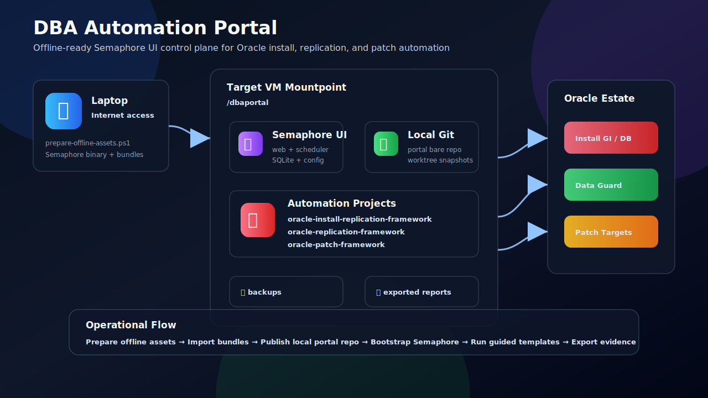

<div align="center">

# DBA Automation Portal

**Unified DBA automation control plane for Oracle install, replication, and patch operations.**


</div>

---

## Overview

DBA Automation Portal adalah portal operasional berbasis Semaphore UI untuk mengonsolidasikan tiga framework otomasi database:

| Domain | Framework | Purpose |
| --- | --- | --- |
| 🟥 Install + Replication | `oracle-install-replication-framework` | Build Oracle GI/ASM/DB, patch during install, Active Data Guard |
| 🟩 Data Guard | `oracle-replication-framework` | Physical standby, broker, render/run staged replication |
| 🟦 Patching | `oracle-patch-framework` | Inventory, precheck, full patch, resume, reports, evidence |

Portal ini didesain untuk kondisi VM tidak punya internet bebas. Artifact disiapkan dari laptop, lalu semua runtime dan growth data dikonsolidasikan di satu mountpoint:

```text
/dbaportal
```

---

## Architecture



---

## What You Get

| Capability | Output |
| --- | --- |
| 🎛️ Unified control plane | Satu project Semaphore: `DBA Automation` |
| 📦 Offline delivery | Binary Semaphore, git bundle, worktree snapshot, checksum |
| 🧭 Guided task templates | Patch health check, add host, inventory, dry-run, precheck, full patch, resume |
| 🛡️ Guardrails | Confirmation gate, lock precheck, inventory backup, dry-run-first workflow |
| 📊 Evidence | `RUN_ID`, `REPORT_PATH`, `SUMMARY_PATH`, exported HTML report |
| 🗂️ Controlled growth | Data, repo, backups, exports, SQLite, logs under `/dbaportal` |

---

## Portal Task Families

| Group | Templates |
| --- | --- |
| 🧪 Portal | Health check and local repository validation |
| 🏗️ Install + Replication | Validate, plan, precheck, install phases, ADG, broker, reports |
| 🔁 Data Guard | Init config, validate, render, setup SSH, staged run |
| 🩺 Patch Operations | Health check, add host, inventory, status, dry-run, precheck, full patch, resume, reports |

---

## Documentation

| Document | Purpose |
| --- | --- |
| 📘 [Deployment Guide](docs/deployment_guide.md) | Full installation, bootstrap, operations, backup, update, and troubleshooting guide |
| 🩺 [Patch Operator Flow](docs/patch-operator-flow.md) | Day-to-day Oracle Patch workflow from Semaphore UI |
| 🧾 [Semaphore Catalog](semaphore/catalog.md) | Manual template catalog when API bootstrap is not used |
| 🔗 [References](docs/references.md) | Upstream Semaphore UI references |

---

## Operating Principle

```text
Prepare from laptop -> copy to VM -> install under /dbaportal -> bootstrap Semaphore -> run guided templates
```

All technical steps are maintained in the [Deployment Guide](docs/deployment_guide.md).

